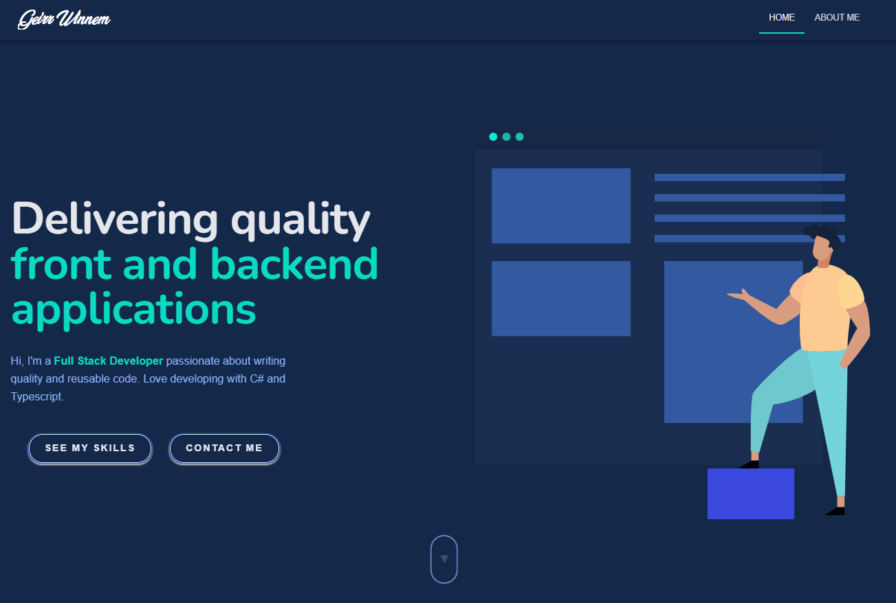

# Geirr Winnem Portfolio (quasar-portfolio-gwinnem)

Portfolio Website for Geirr Winnem

[Forked from Ivancic Josip vue project](https://github.com/josip2312/vue3-portfolio)

Part of the HomePage


## Install the dependencies

```
yarn
# or
npm install
```

### Start the app in development mode (hot-code reloading, error reporting, etc.)

```
quasar dev
```

### Lint the files

```
yarn lint
# or
npm run lint
```

### Format the files

```
yarn format
# or
npm run format
```

### Build the app for production

```
quasar build
```

### Customize the configuration

See [Configuring quasar.config.js](https://v2.quasar.dev/quasar-cli-vite/quasar-config-js).
